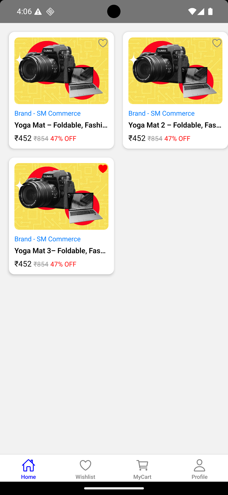
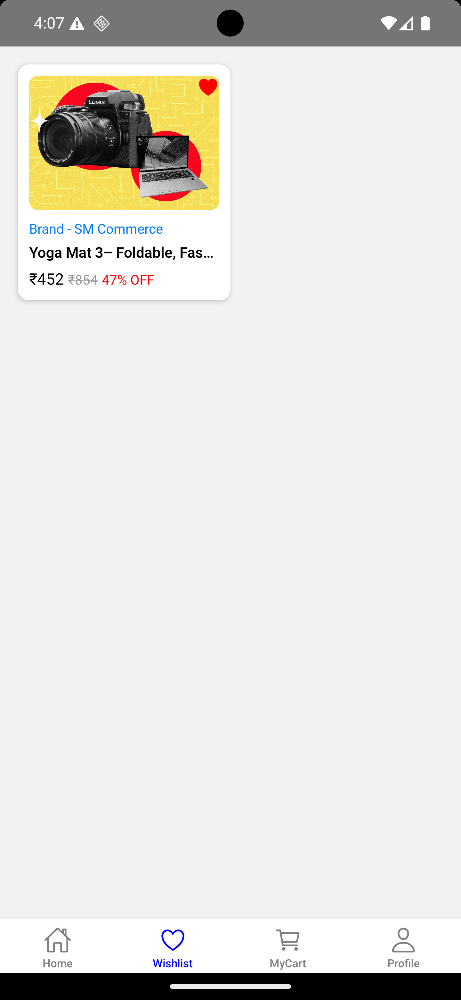
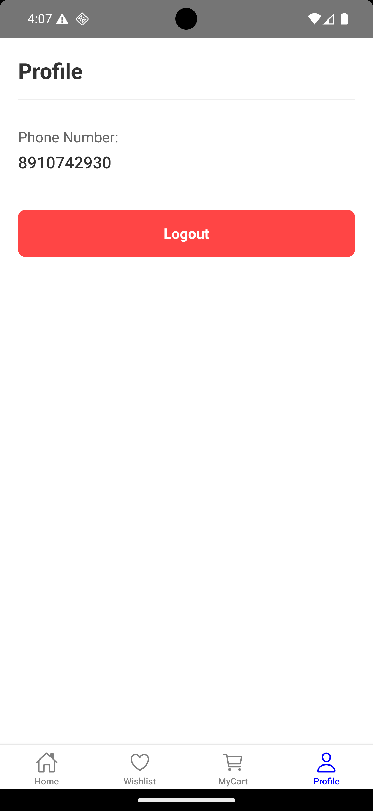
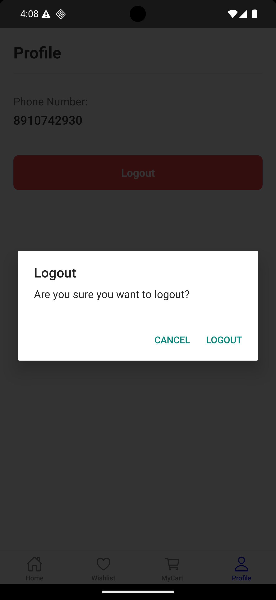
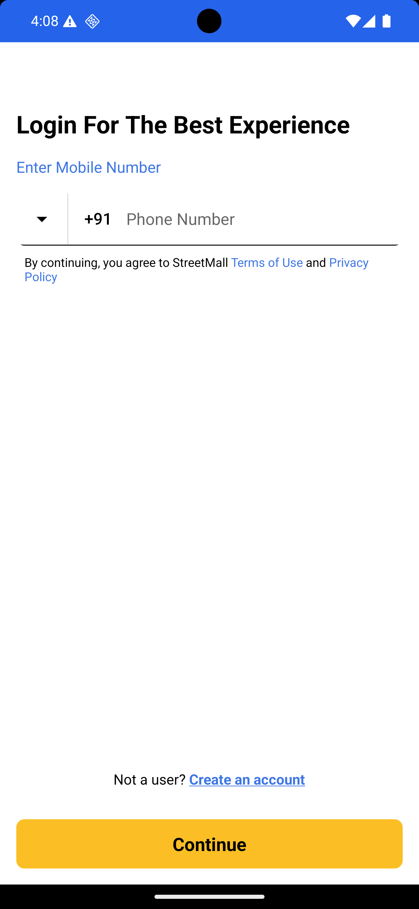
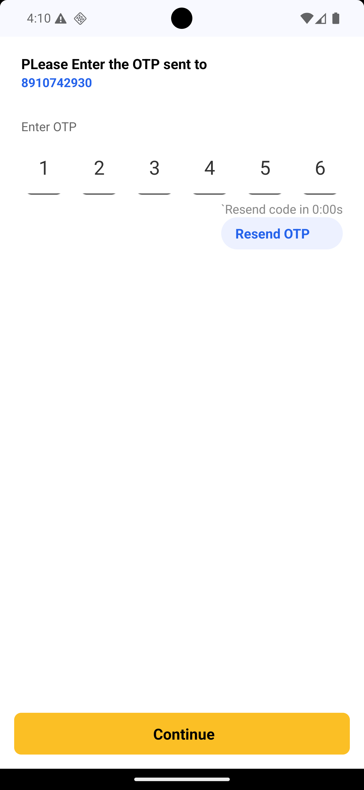

Sure! Here's the complete `.md` file content formatted correctly — you can copy and save it as `README.md` in your project root:

---

 # AurelionFutureForge-Assignment

A simple React Native app that displays a product listing and allows users to add or remove items from their wishlist using Zustand for state management and AsyncStorage for persistence.

## 📱 Features

- Authentication Screen
- Product grid listing
- Wishlist functionality
- Zustand store for global state
- AsyncStorage for data persistence
- Heart icon toggle for adding/removing products from wishlist
- Wishlist screen to view only favorited products

---

## 🚀 Getting Started

Follow these steps to set up the project locally.

### Prerequisites

- Node.js (>= 14.x)
- npm or yarn
- React Native CLI
- Android Studio or physical Android device

---

### 🔧 Installation

1. **Clone the repository:**

   ```bash
   git clone https://github.com/arijitdas13105/AurelionFutureForge-Assignment.git
   cd AurelionFutureForge-Assignment
    ````
2. **Install dependencies:**

   ```bash
   npm install 
   ```

---

### ▶️ Run the App

Open **two terminal windows or tabs**:

#### Terminal 1 – Start Metro Bundler

```bash
npx react-native start
```

#### Terminal 2 – Run on Android

```bash
npx react-native run-android
```

> 💡 Make sure an Android emulator is running or a device is connected.

---
> 💡💡 And the OTP will be always -123456 

---
 

## ✅ Assignment Requirements Checklist

* [x] Product listing screen with 2-column layout
* [x] Wishlist functionality
* [x] Zustand used for state management
* [x] AsyncStorage used for persistence
* [x] Separate wishlist screen
* [x] Basic UI with brand, title, price, original price, and discount
* [x] README with setup instructions ✅

---

## 📸 Screenshot





 


 